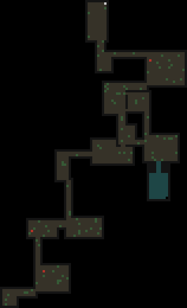
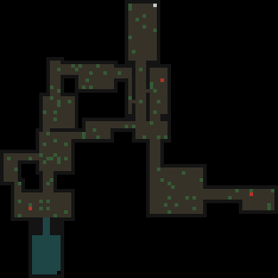

# DungeonBuild

A python-based game in which players can defeat monsters in procedurally generated, random, underground dungeons to earn coins. These coins can be used to purchase blocks and items to expand the overground gameworld.

## Table of Contents
- [Video Showcase](#video-showcase)
- [Installation](#installation)
- [Features](#features)
- [Controls](#controls)
- [License](#license)
- [Acknowledgements](#acknowledgements)

## Video Showcase
[Youtube Link:]((https://www.youtube.com/watch?v=tZJ1gr_GUmo))

[](https://www.youtube.com/watch?v=tZJ1gr_GUmo)

## Installation

Follow these steps to set up the project on your local machine:

### Prerequisites

Make sure you have Python 3.12.4 installed on your system. You can download it from [Python's official website](https://www.python.org/downloads/release/python-3124/).

### Technologies

- Python 3.12.4
- Pillow 10.3.0
- Pygame 2.5.2

### Steps

1. **Clone the Repository:**
    Clone this repository to your local machine by using the following command:
    ```sh
    git clone https://github.com/dancampb3ll/DungeonBuild.git
    ```

2. **Navigate to the Project Directory:**
    Change your working directory to the project folder:
    ```sh
    cd DungeonBuild
3. **Create a Virtual Environment** (optional but recommended):
    
    Create:
    ```sh
    python -m venv venv
    ```

    Activate:
    - On Windows:
        ```sh
        venv\Scripts\activate
        ```
    - On macOS and Linux:
        ```sh
        source venv/bin/activate
        ```
4. **Install Required Packages:** (optional but recommended):
    Install the required packages listed in `requirements.txt`:
    ```sh
    pip install -r requirements.txt
    ```
    
    Alternatively:
    ```sh
    pip install pygame==2.5.2 pillow==10.3.0
    ```
5. **Run the Project:** 
    Start the project by running the main script:
    ```sh
    python main.py
    ```

## Features
- Dungeon Generation
    - Uses a set of rules in `underworld/tiles.py` to randomly generate a spawn room, square rooms, walkways, enemy spawn points, and a final exit room.
    - `dungeonDraw.py` uses Pillow to rapidly draw hundreds of dungeon images from the dungeon generation algorithm and the map data structures it produces. This allows for a rapid prototyping of changes made to the generation algorithm.

        
        
        
- Lighting
    - Lights up tiles, npcs, and projectiles in the underworld dependent on the distance from the player. In `lighting.py`
- Save Games & Load Menu
    - The player can save the game from the overworld.
- Building
    - All overworld tiles adhere to a 16x16 grid system.
    - The player can use the right click button whilst in build-mode to expand the overworld with grass blocks, as long as it is placed adjacently to an existing grass block.
    - The player can use the left click button whilst in build-mode to place buildings on top of grass blocks.
- Combat
    - Melee based.
    - NPCs can use projectiles.
    - Knockback.
    
    

- Shop & Inventory System
    - The player can use coins to purchase buildings and blocks from the shop.
    - These then fill the inventory.


## Controls
- Overworld:
    - WASD: Move player.
    - B: Open/close build menu.
    - Left Click: Place selected block (in build mode).
    - Right Click: Place grass block (in build mode).
    - Scroll Wheel: Cycle through held build items (in build mode). 
    - Number Keys: Purchase items (when in shop). 
- Dungeon:
    - WASD: Move player.
    - Spacebar: Swipe sword to attack.

## License
This project is licensed under the Creative Commons Attribution-NonCommercial-NoDerivatives 4.0 International License. See the [LICENSE](LICENSE) file for details.

[](http://creativecommons.org/licenses/by-nc-nd/4.0/)

## Acknowledgements
- OpenGameArt.org for some drawings used.
- SoundImage.org for some music and sfx used.